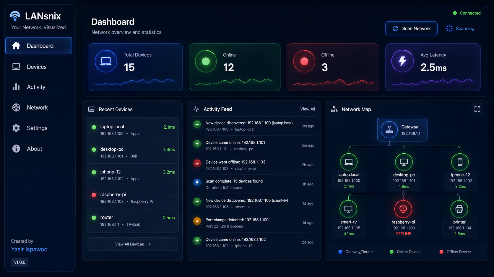
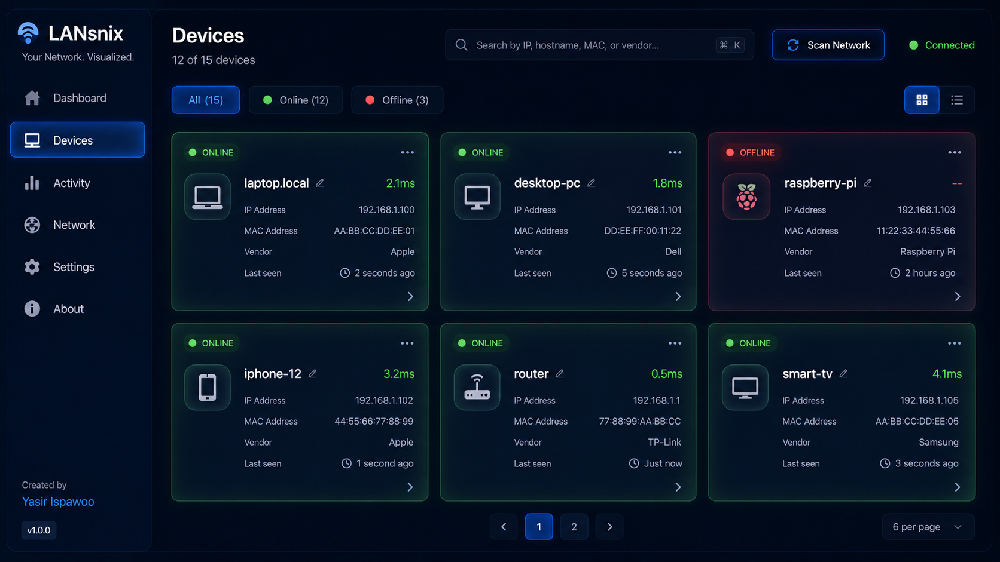
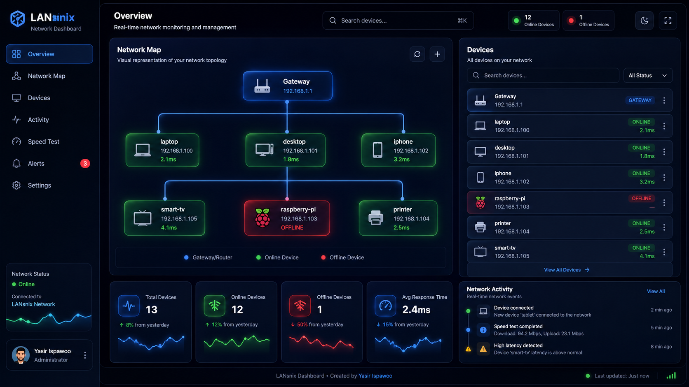
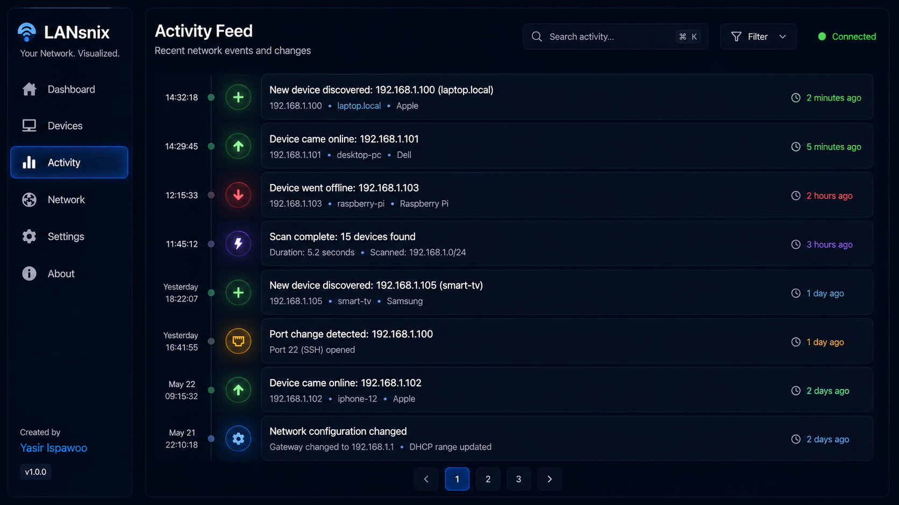

<div align="center">

# 🌐 LANsnix

### Realtime LAN Discovery & Monitoring Platform

**Your Network. Visualized.**

[](https://opensource.org/licenses/MIT)
[](https://golang.org)
[](https://nextjs.org)
[](https://www.docker.com)
[](https://www.linux.org)



*A modern, self-hosted network observability platform for homelabs, cybersecurity enthusiasts, and Linux users.*

[Features](#-features) • [Quick Start](#-quick-start) • [Installation](#-installation) • [Documentation](#-documentation) • [Contributing](#-contributing)

</div>

---

## 🎯 Overview

**LANsnix** is a premium open-source LAN monitoring platform that combines the power of Nmap with the elegance of modern observability dashboards. Built for Linux-first environments, it provides realtime device discovery, port scanning, and network visualization.

### Perfect For

- 🏠 Homelab enthusiasts
- 🔒 Cybersecurity professionals
- 🐧 Linux power users
- 🛠️ Network administrators
- 👨‍💻 Self-hosters and developers

---

## ✨ Features

### 🔍 **Device Discovery**
- **ARP & ICMP Scanning** - Fast network-wide device detection
- **Hostname Resolution** - Automatic DNS lookups
- **MAC Vendor Detection** - Identify device manufacturers (offline database)
- **Realtime Status** - Live online/offline monitoring with latency tracking

### 🔌 **Port Scanning**
- **Fast TCP Scanning** - Concurrent port detection
- **Service Identification** - Recognize SSH, HTTP, HTTPS, FTP, SMB, DNS, RDP
- **Configurable Ranges** - Scan specific ports or common services

### 📊 **Modern Dashboard**
- **Realtime Updates** - WebSocket-powered live data
- **Cybersecurity Aesthetic** - Dark mode with glassmorphism and neon accents
- **Network Topology** - Animated visual network map
- **Activity Feed** - Historical events and device timeline

### 🚨 **Notifications**
- **Realtime Alerts** - New devices, disconnections, port changes
- **Toast Notifications** - Non-intrusive UI alerts
- **Event History** - Persistent activity logging

### 🎨 **Premium UI/UX**
- **Responsive Design** - Desktop, tablet, and mobile support
- **Smooth Animations** - Framer Motion powered transitions
- **Search & Filtering** - Quick device lookup and sorting
- **Dark Mode First** - Optimized for extended monitoring sessions

---

## 🏗️ Architecture

```
┌─────────────────────────────────────────────────────────┐
│                     Frontend (Next.js)                   │
│  ┌──────────┐  ┌──────────┐  ┌──────────┐  ┌─────────┐ │
│  │Dashboard │  │ Devices  │  │ Network  │  │Activity │ │
│  │          │  │          │  │   Map    │  │  Feed   │ │
│  └──────────┘  └──────────┘  └──────────┘  └─────────┘ │
└────────────────────┬────────────────────────────────────┘
                     │ REST API + WebSocket
┌────────────────────┴────────────────────────────────────┐
│                   Backend (Go)                           │
│  ┌──────────┐  ┌──────────┐  ┌──────────┐  ┌─────────┐ │
│  │  Scanner │  │  Port    │  │ Vendor   │  │ Activity│ │
│  │  Service │  │  Scanner │  │ Detector │  │ Logger  │ │
│  └──────────┘  └──────────┘  └──────────┘  └─────────┘ │
└────────────────────┬────────────────────────────────────┘
                     │
              ┌──────┴──────┐
              │   SQLite    │
              │  Database   │
              └─────────────┘
```

---

## 🚀 Quick Start

### Docker (Recommended)

```bash
# Clone the repository
git clone https://github.com/ispawoo/lansnix.git
cd lansnix

# Start with Docker Compose
docker compose up -d

# Access the dashboard
open http://localhost:3000
```

### Linux Binary

```bash
# Download and install
curl -fsSL https://raw.githubusercontent.com/ispawoo/lansnix/main/scripts/install.sh | bash

# Start the service
sudo systemctl start lansnix

# Access the dashboard
open http://localhost:3000
```

---

## 📦 Installation

### Prerequisites

- **Linux** (Ubuntu 20.04+, Debian 11+, Arch Linux, Raspberry Pi OS)
- **Docker** (optional, recommended)
- **Root/sudo access** (for network scanning)

### Method 1: Docker Compose

```bash
git clone https://github.com/ispawoo/lansnix.git
cd lansnix
cp .env.example .env
docker compose up -d
```

### Method 2: Standalone Binary

```bash
# Ubuntu/Debian
wget https://github.com/ispawoo/lansnix/releases/latest/download/lansnix-linux-amd64
chmod +x lansnix-linux-amd64
sudo mv lansnix-linux-amd64 /usr/local/bin/lansnix

# Install as systemd service
sudo lansnix install
sudo systemctl enable --now lansnix
```

### Method 3: Build from Source

```bash
# Install dependencies
sudo apt-get install -y libpcap-dev

# Clone and build backend
git clone https://github.com/ispawoo/lansnix.git
cd lansnix/backend
go build -o lansnix ./cmd/server

# Build frontend
cd ../frontend
npm install
npm run build

# Run
cd ../backend
sudo ./lansnix
```

---

## 🔧 Configuration

Edit `.env` or `/etc/lansnix/config.yaml`:

```yaml
# Network Settings
scan_interval: 60s
subnet: auto  # or specify: 192.168.1.0/24

# Port Scanning
port_scan_enabled: true
port_ranges: 22,80,443,3389,445,21,53

# API Settings
api_port: 8080
frontend_port: 3000

# Database
db_path: /var/lib/lansnix/lansnix.db
```

---

## 📖 Documentation

### API Endpoints

```
GET    /api/devices          - List all devices
GET    /api/devices/:id      - Get device details
POST   /api/scan             - Trigger network scan
GET    /api/activity         - Get activity feed
GET    /api/ports/:id        - Get device ports
WS     /api/ws               - WebSocket for realtime updates
```

### WebSocket Events

```json
{
  "type": "device_online",
  "data": {
    "ip": "192.168.1.100",
    "hostname": "laptop",
    "mac": "AA:BB:CC:DD:EE:FF"
  }
}
```

---

## 🛡️ Security

- **Rate Limiting** - API protection against abuse
- **Input Sanitization** - SQL injection prevention
- **Secure WebSockets** - Authenticated realtime connections
- **Linux Capabilities** - Minimal privilege requirements
- **No External APIs** - All data stays local

### Required Permissions

LANsnix requires `CAP_NET_RAW` for packet capture:

```bash
sudo setcap cap_net_raw+ep /usr/local/bin/lansnix
```

---

## 🎨 Screenshots

<div align="center">

### Dashboard


### Device Details


### Network Map


### Activity Feed


</div>

---

## 🗺️ Roadmap

- [x] Device discovery (ARP/ICMP)
- [x] Port scanning
- [x] Realtime monitoring
- [x] Network visualization
- [ ] Bandwidth monitoring
- [ ] Speed test integration
- [ ] Custom device aliases
- [ ] Scan scheduling
- [ ] CSV/JSON export
- [ ] Mobile app
- [ ] Multi-subnet support
- [ ] SNMP integration

---

## 🤝 Contributing

Contributions are welcome! Please read our [Contributing Guide](CONTRIBUTING.md) first.

```bash
# Fork the repository
git clone https://github.com/yourusername/lansnix.git
cd lansnix

# Create a feature branch
git checkout -b feature/amazing-feature

# Make your changes and commit
git commit -m "Add amazing feature"

# Push and create a PR
git push origin feature/amazing-feature
```

---

## 📄 License

This project is licensed under the MIT License - see the [LICENSE](LICENSE) file for details.

---

## 👨‍💻 Author

**Created by [Yasir Ispawoo](https://github.com/ispawoo)**

If you find LANsnix useful, please consider:
- ⭐ Starring the repository
- 🐛 Reporting bugs
- 💡 Suggesting features
- 🤝 Contributing code

---

## 🙏 Acknowledgments

- Inspired by Nmap, Uptime Kuma, and Angry IP Scanner
- Built with Go, Next.js, and modern web technologies
- Community feedback and contributions

---

<div align="center">

**[⬆ Back to Top](#-lansnix)**

Made with ❤️ for the Linux and homelab community

</div>
